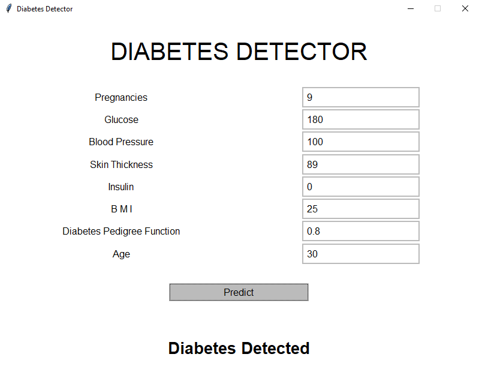
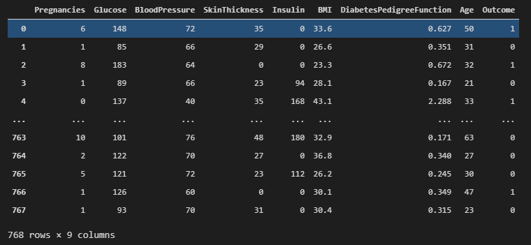

# Diabetes Detector

Diabetes adalah penyakit kronis yang ditandai dengan ciri-ciri berupa tingginya kadar gula (glukosa) darah. Glukosa merupakan sumber energi utama bagi sel tubuh manusia.

Glukosa yang menumpuk di dalam darah akibat tidak diserap sel tubuh dengan baik dapat menimbulkan berbagai gangguan organ tubuh. Jika diabetes tidak dikontrol dengan baik, dapat timbul berbagai komplikasi yang membahayakan nyawa penderita.

Kadar gula dalam darah dikendalikan oleh hormon insulin yang diproduksi oleh pankreas, yaitu organ yang terletak di belakang lambung. Pada penderita diabetes, pankreas tidak mampu memproduksi insulin sesuai kebutuhan tubuh. Tanpa insulin, sel-sel tubuh tidak dapat menyerap dan mengolah glukosa menjadi energi. (referensi: Diabetes - Gejala, penyebab dan mengobati - Alodokter)

Penderita diabetes sangat banyak di dunia, terutama di Indonesia. Pada tahun 2020 penderita diabetes di indonesia naik 6,2 persen. Hal tersebut juga merupakan salah satu dampak pandemi COVID-19. (referensi: Naik 6,2 Persen Selama Pandemi, Pasien Diabetes Indonesia Peringkat 7 di Dunia Halaman all - Kompas.com)

Kurangnya kesadaran akan penyakit ini juga salah satu penyebabnya. Pendeteksian sejak dini merupakan salah satu cara untuk mencegah penyakit diabetes bertambah parah dan tingkat pemulihan semakin besar.

Maka dari itu saya membuat aplikasi ini dengan maksud untuk mendeteksi diabetes pada orang orang. Dengan begitu jika ada yang terdeteksi mengidap diabetes, bisa segera menjalankan langkah yang tepat agar dapat menurunkan tingkat penyakitnya.

## Dataset

## Pairplot Dataset

## Tingkat Kepentingan Data

